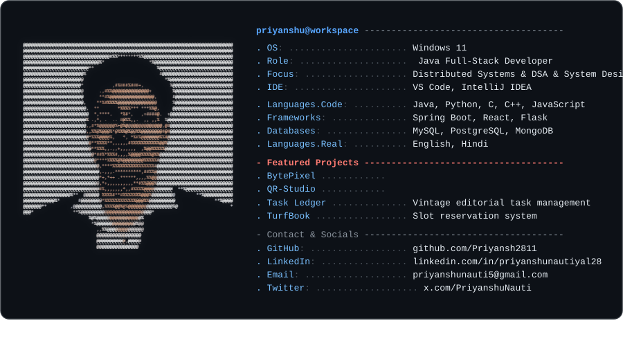
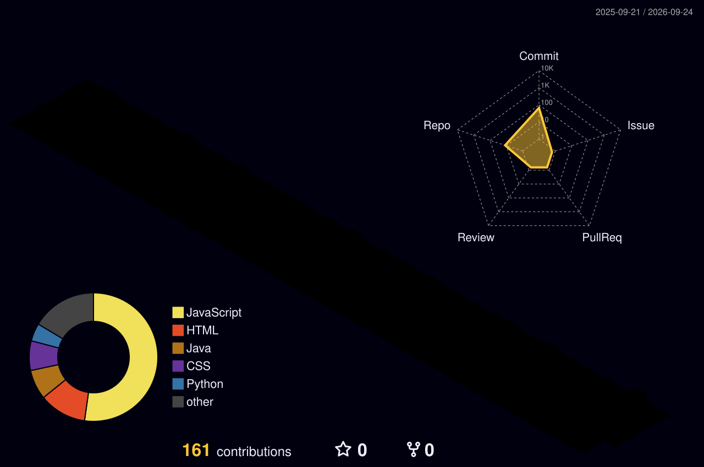
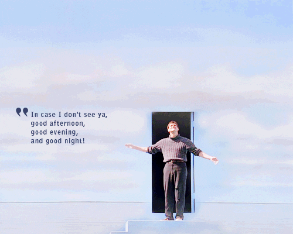

  

  

### 💻 Tech Stack

<!-- Languages -->

  
  
  
  
  

<!-- Backend & Frontend -->

  
  
  
  

<!-- Databases -->

  
  

<!-- DevOps & Tools -->

  
  
  
  

  <picture>
    <source media="(prefers-color-scheme: dark)" srcset="./profile-3d-contrib/profile-night-rainbow.svg">
    <source media="(prefers-color-scheme: light)" srcset="./profile-3d-contrib/profile-green-animate.svg">
    
  </picture>

  <picture>
    <source media="(prefers-color-scheme: dark)" srcset="https://raw.githubusercontent.com/Priyansh2811/Priyansh2811/output/github-contribution-grid-snake-dark.svg">
    <source media="(prefers-color-scheme: light)" srcset="https://raw.githubusercontent.com/Priyansh2811/Priyansh2811/output/github-contribution-grid-snake.svg">
    
  </picture>

<table align="center" width="100%" style="border: none; background: transparent;">
  <tr style="border: none; background: transparent;">
    <!-- Left: Thank You & Connect Note -->
    <td width="55%" align="left" valign="middle" style="border: none; padding-right: 20px;">
      <h3>✨ Thanks for stopping by!</h3>
      

        I'm always open to discussing new opportunities, distributed systems, open-source projects, or tech in general.
      

      

        ⭐ If you found any of my repositories or tools helpful, consider dropping a star or reaching out!
      

      

        
      

    </td>
    <!-- Right: Truman Show Bow GIF -->
    <td width="45%" align="center" valign="middle" style="border: none;">
      
    </td>
  </tr>
</table>